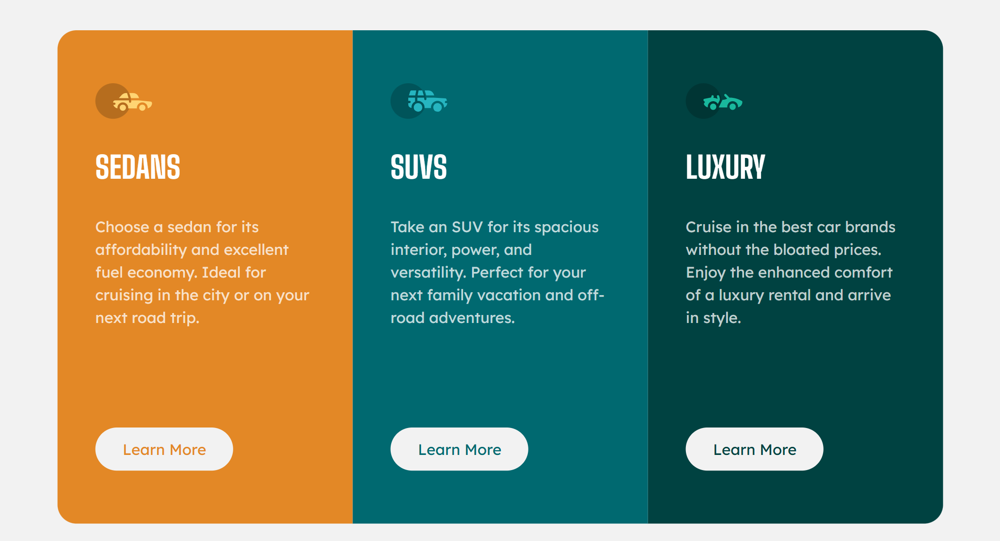

# Frontend Mentor - 3 Column Preview Card Component

This is my solution to the [3 Column Preview Card Component](https://www.frontendmentor.io/challenges/3column-preview-card-component-pH92eAR2-) challenge on Frontend Mentor.

## 📸 Screenshot

## 🔗 Links

- Live Site URL: [3 Column Preview Card - Live](https://telmomanduco.github.io/3-column-preview-card-component-main/)
- Solution on Frontend Mentor: [Frontend Mentor 3 Column Preview Card](https://www.frontendmentor.io/solutions/3-column-preview-card-component-gridflex-GOg1naTF1d)

## 💻 Built with

- Semantic HTML5
- CSS Grid and Flexbox
- Mobile-first workflow
- Google Fonts (Lexend Deca, Big Shoulders)

## 🚀 What I learned

While building this project, I practiced:

- Using CSS Grid for responsive card layouts
- Combining Flexbox inside cards for alignment and spacing
- Building mobile-first design and expanding to desktop with media queries

## 🙋‍♂️ Author

- GitHub: [@TelmoManduco](https://github.com/TelmoManduco)
- Frontend Mentor: [@TelmoManduco](https://www.frontendmentor.io/profile/TelmoManduco)
